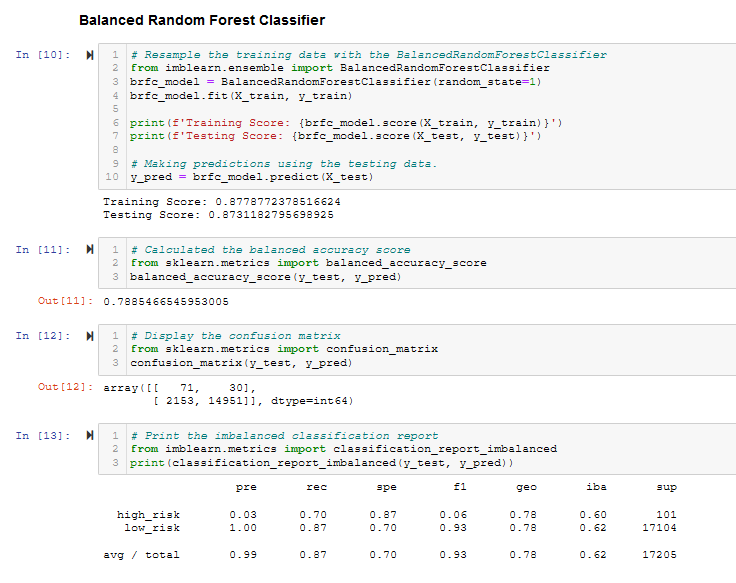
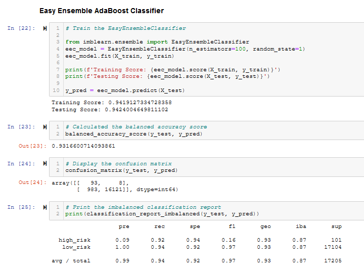

# Credit_Risk_Analysis

## Overview

This goal of project was to learn how to employ different techniques to train and evaluate models with unbalanced classes. We used the imbalanced-learn and scikit-learn libraries to build and evaluate models using resampling. For each machine learning model, the steps are:

1. Prepare data (ETL, identfy input 'features' aka factors', from output 'targets', and optionally encode)
2. Instantiate a machine learning model with a random seed and other parameters
3. Create training and testing datasets
4. Fit/train the model with training data
5. Make predictions with test data
6. Evaluate the model's performance
7. Repeat steps 2-6 until goals are satisfied

###### Technologies Used:

- Jupyter Notebook
- LendingClub peer-to-peer data (LoanStats_2019Q1.csv)
- Scikit-learn API
  - sklearn.preprocessing.**StandardScaler**
  - sklearn.linear_model.**LogisticRegression**
  - sklearn.ensemble.**EasyEnsembleClassifier** (with AdaBoost learners) below
- Imbalanced-learn API
  - imblearn.over_sampling.**RandomOverSampler** (over_sampling)
  - imblearn.over_sampling.**SMOTE** (over_sampling) [*See Note A below*]
  - imblearn.under_sampling.**ClusterCentroids** (under_sampling)
  - imblearn.combine.**SMOTEENN** (combination of over_sampling and under_sampling) [*See Note B below*]
  - imblearn.ensemble.**BalancedRandomForestClassifier** (reduces bias)
  - imblearn.ensemble.**EasyEnsembleClassifier** (reduces bias)

Notes:
+ A: SMOTE = synthetic minority oversampling technique
+ B: SMOTEEN = SMOTE and Edited Nearest Neighbors (ENN)

## Results

**Please see the Summary section at the bottom of this README file for the performance and recommendation data**. The detailed results (accuracy score, confusion matrix, and imbalanced classification report) for each ML model are shown below in Figures 5, 6, 7, 8, 9, and 11. The sorted features for BalancedRandomForestClassifier (and probable bug) are shown in Figure 10 below.

#### Deliverable 1 - Use Resampling Models to Predict Credit Risk

Using our knowledge of the imbalanced-learn and scikit-learn libraries, we evaluated three machine learning models by using resampling to determine which is better at predicting credit risk. First, we used the oversampling RandomOverSampler and SMOTE algorithms, and then we used the undersampling ClusterCentroids algorithm. Using these algorithms, we resampled the dataset, viewed the count of the target classes, trained a logistic regression classifier, calculated the balanced accuracy score, generated a confusion matrix, and generated a classification report.

##### Credit Risk Resampling Techniques

###### Step 1: Read the CSV and Perform Basic Data Cleaning

Figure 1. Dataframe 'df' created by reading LoanStats_2019Q1.csv

Figure 2. Create 'features' dataframe X, and 'target' Series/array y

Figure 3. The X_enc dataframe after encoding with pandas.get_dummies()

###### Step 2: Split the Data into Training and Testing

Figure 4. Calling sklearn.model_selection.train_test_split() to create train and test data

##### Oversampling

###### Step 3: Naive Random Oversampling

Figure 5. Results for Naive Random Oversampling with imblearn.over_sampling.RandomOverSampler

###### Step 4: SMOTE Oversampling

Figure 6. Results for SMOTE Oversampling with imblearn.over_samplng.SMOTE

##### Step 5: Undersampling

Figure 7. Results for Undersampling with imblearn.under_sampling.ClusterCentroids

#### Deliverable 2 - Use the SMOTEENN algorithm to Predict Credit Risk

Using our knowledge of the imbalanced-learn and scikit-learn libraries, we used a combinatorial approach of over- and undersampling with the SMOTEENN algorithm to determine if the results from the combinatorial approach are better at predicting credit risk than the resampling algorithms from Deliverable 1. Using the SMOTEENN algorithm, we resampled the dataset, viewed the count of the target classes, trained a logistic regression classifier, calculated the balanced accuracy score, generated a confusion matrix, and generated a classification report.

##### Step 6: Combination (Over and Under) Sampling

Figure 8. Results for Combination (Over and Under) Sampling with imblearn.combine.SMOTEEN

#### Deliverable 3 - Use Ensemble Classifiers to Predict Credit Risk

Using our knowledge of the imblearn.ensemble library, we trained and compared two different ensemble classifiers, BalancedRandomForestClassifier and EasyEnsembleClassifier, to predict credit risk and evaluate each model. Using both algorithms, we resampled the dataset, viewed the count of the target classes, trained the ensemble classifier, calculated the balanced accuracy score, generated a confusion matrix, and generated a classification report.

##### Step 7a: Balanced Random Forest Classifier

Figure 9. Results for Ensemble Classifiers with imblearn.ensemble.BalancedRandomForestClassifier

##### Step 7b: Sort the features_importances_ for BalancedRandomForestClassifier

The column name vs features_importances_ value are sorted in Figure 10. The list of names & values given in the sample code shows that the values were sorted in reverse numerical order, then zipped with the original column names. This is the 'wrong' way, since the values are rearranged, but the column names of the features are not. So the values do not match the name for the value. Also shown in Figure 10 is the 'correct' way to do it.

Note that the wrong way shows the most important feature to be the loan amount (loan_amnt), and the second most important feature is the interest rate (int_rate).

The correct way shows that the most important feature is total recovered principle (total_rec_prncp), and the second most important feature is the total payments made (total_pymnt).

Figure 10. Sorted Features, and probable bug in credit_risk_ensemble_starter_code.ipynb

##### Step 8: Easy Ensemble AdaBoost Classifier

Figure 11. Results for Ensemble Classifiers with imblearn.ensemble.EasyEnsembleClassifier (with AdaBoost)

## Summary

The summary results for all ML models is shown in Table 1. **The overall best-performing Machine Learning (ML) model was the EasyEnsemble with AdaBoost classifier**. It's Balanced Accuracy Score (Acc) was .9317 (93.17%), which was the highest of any of the models. Precision (Prec), Sensitivity/Recall (Sens), and Harmonic Mean (F1) are shown for the 'High-Risk' (H) and 'Low-Risk' (L) categories, and Average (Avg) over both H & L.

Table 1. Comparison of ML Model Performance Metrics

| Model                          |   Acc |     Prec  (H/L/Avg)|     Sens (H/L/Avg) |        F1 (H/L/Avg)|
| :--                            |   --: |                --: |                --: |               --:  |
| Naive Random Oversampling      | .6648 | 0.01 / 1.00 / 0.99 | 0.73 / 0.60 / 0.60 | 0.02 / 0.75 / 0.74 |
| SMOTE Oversampling             | .6624 | 0.01 / 1.00 / 0.99 | 0.63 / 0.69 / 0.69 | 0.02 / 0.82 / 0.81 |
| ClusterCentroids Undersampling | .5447 | 0.01 / 1.00 / 0.99 | 0.69 / 0.40 / 0.40 | 0.01 / 0.57 / 0.56 |
| SMOTEEN Over and Undersampling | .6435 | 0.01 / 1.00 / 0.99 | 0.71 / 0.57 / 0.57 | 0.02 / 0.73 / 0.72 |
| BalancedRandomForest Ensemble  | .7885 | 0.03 / 1.00 / 0.99 | 0.70 / 0.87 / 0.87 | 0.06 / 0.93 / 0.93 |
| **EasyEnsemble AdaBoost**      | **.9317** | **0.09 / 1.00 / 0.99** | **0.92 / 0.94 / 0.94** | **0.16 / 0.97 / 0.97** |

What we know about precision vs. sensitivity in ML algorithms:

High Precision:
- Example: "If test is positive, there's a high likelihood of cancer".
- Answers the question: "How reliable is a positive result"?
- Can have a high False Negative rate.
- Is a "conservative" algorithm.

High Sensitivity:
- Example: "Among patients with cancer, most will be diagnosed correctly".
- Answers the question: "Does it have the ability to find all the positives"?
- Can have a high False Positive rate.
- Is an "aggressive" algorithm.

Given the above facts, we can see that even though the EasyEnsemble algorithm performs better than the others, it still has a very low precision (9%) for High Credit Risk individuals. So this means that if a person shows up as a bad credit risk, there's only a 9% chance that this is true. Thus many customers who actually are good credit risks would be denied credit.

On the other hand, EasyEnsemble has a very high sensitivity (i.e. recall), so out of all the people with bad credit, the algorithm will find them (but it will lump many people with good credit in with the bad as we just saw).

  - **So our final recommendation would be to keep looking for a better ML algorithm to detect credit risk.**

#### A Note about the aptly-named "Confusion Matrix"

Referring to any of the figures above that show the confusion matrix output from scikit-learn (e.g. Figure 5), you can see how confusion matrices are portrayed by sklearn.metrics.confusion_matrix() [See https://scikit-learn.org/stable/modules/model_evaluation.html#confusion-matrix ]. According to the documentation, the meaning of each number of the sklearn confusion matrix are described in Table 2, and the values are shown in Table 3.

Table 2. Confusion matrix representation in Scikit-Learn documentation

|  | Predcted False | Predictsed True |
| :-- | :--: | :--: |
| **Actual False** | True Negative (TN) | False Positive (FP) |
| **Actual True** | False Negative (FN) | True Positive (TP) |

Table 3. Confusion matrix valules from Figure 5

|  | Predcted False | Predictsed True |
| :-- | --: | --: |
| **Actual False** | 74 | 27 |
| **Actual True** | 6895 | 10,209 |

Note that each and every cell in Table 2 is different from the representation of a confusion matrix in our BCS material and other websites and books, as shown in Table 4. I have no idea why there is a difference, but it does in fact create a lot of confusion

Table 4. Confusion matrix representation in BCS and other ML material

|  | Predcted True | Predictsed False |
| :-- | :--: | :--: |
| **Actual True** | TP | FN |
| **Actual False** | FP | TN |

Using the numbers from Figure 5 (and/or Table 3), we get:

- Precision = TP / (TP + FP) = 10,209 / (10,209 + 27) = .9973

- Sensitivity = TP / (TP + FN) = 10,209 / (10,209 + 6,895) = .5969

- F1 Score = 2 * Prec. * Sens. / (Prec. + Sens.) = 2 * .9973 * .5969 / (.9973 + .5969) = .7468

Those numbers match the precision ('pre'), sensitivity aka recall ('rec') and F1 ('f1') columns of the classification_report_imbalanced() report in Figure 5 for the 'low_risk' row when rounded to two decimal places. I'm not quite sure how the other data in that report is derived. Deciphering the rest of the report is left as an exercise for the reader.
