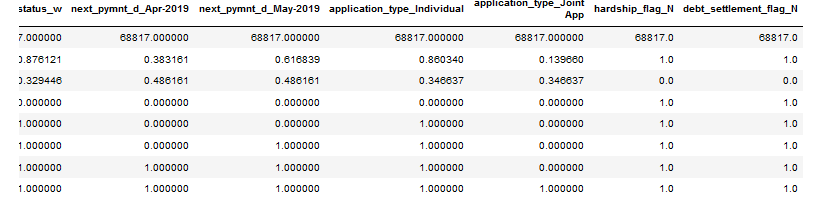

# Credit_Risk_Analysis

## Overview

This project was to learn how to employ different techniques to train and evaluate models with unbalanced classes. We used the imbalanced-learn and scikit-learn libraries to build and evaluate models using resampling. For each machine learning model, the steps are:

1. Prepare data (ETL, identfy input 'features' (aka factors') from output 'targets', and optionally encode)
2. Instantiate a machine learning model with a random seed and other parameters
3. Create training and testing datasets
4. Fit/train the model with training data
5. Make predictions with test data
6. Evaluate the model's performance
7. Repeat steps 2-5 until goals are satisfied

###### Technologies Used:

- Jupyter Notebook
- LendingClub peer-to-peer data (LoanStats_2019Q1.csv)
- Scikit-learn API
  - sklearn.preprocessing.StandardScaler
  - sklearn.linear_model.LogisticRegression
  - sklearn.ensemble.AdaBoostClassifier (with EasyEnsembleClassifier below)
- Imbalanced-learn API
  - imblearn.over_sampling.RandomOverSampler (over_sampling)
  - imblearn.over_sampling.SMOTE (over_sampling)
  - imblearn.under_sampling.ClusterCentroids (under_sampling)
  - imblearn.combine.SMOTEENN (combination of over_sampling and under_sampling)
  - imblearn.ensemble.BalancedRandomForestClassifier (reduces bias)
  - imblearn.ensemble.EasyEnsembleClassifier (reduces bias)

## Results

| Model                          |   Acc |     Prec  (H/L/Avg)|     Sens (H/L/Avg) |        F1 (H/L/Avg)|
| :--                            |   --: |                --: |                --: |               --:  |
| Naive Random Oversampling      | .6648 | 0.01 / 1.00 / 0.99 | 0.73 / 0.60 / 0.60 | 0.02 / 0.75 / 0.74 |
| SMOTE Oversampling             | .6624 | 0.01 / 1.00 / 0.99 | 0.63 / 0.69 / 0.69 | 0.02 / 0.82 / 0.81 |
| ClusterCentroids Undersampling | .5447 | 0.01 / 1.00 / 0.99 | 0.69 / 0.40 / 0.40 | 0.01 / 0.57 / 0.56 |
| SMOTEEN Over and Undersampling | .6435 | 0.01 / 1.00 / 0.99 | 0.71 / 0.57 / 0.57 | 0.02 / 0.73 / 0.72 |
| BalancedRandomForest Ensemble  | .7888 | 0.03 / 1.00 / 0.99 | 0.70 / 0.87 / 0.87 | 0.06 / 0.93 / 0.93 |
| **EasyEnsemble AdaBoost**          | **.9316** | **0.09** / 1.00 / 0.99 | **0.92 / 0.94 / 0.94** | **0.16 / 0.97 / 0.97** | 

#### Deliverable 1 - Use Resampling Models to Predict Credit Risk

Using our knowledge of the imbalanced-learn and scikit-learn libraries, we evaluated three machine learning models by using resampling to determine which is better at predicting credit risk. First, we used the oversampling RandomOverSampler and SMOTE algorithms, and then we used the undersampling ClusterCentroids algorithm. Using these algorithms, we resampled the dataset, viewed the count of the target classes, trained a logistic regression classifier, calculated the balanced accuracy score, generated a confusion matrix, and generated a classification report.

##### Credit Risk Resampling Techniques

###### Step 1: Read the CSV and Perform Basic Data Cleaning

###### Step 2: Split the Data into Training and Testing

##### Oversampling

###### Step 3: Naive Random Oversampling

0.6648 (run) vs. 0.6466 (example)

###### Step 4: SMOTE Oversampling

##### Undersampling

#### Deliverable 2 - Use the SMOTEENN algorithm to Predict Credit Risk

Using our knowledge of the imbalanced-learn and scikit-learn libraries, we used a combinatorial approach of over- and undersampling with the SMOTEENN algorithm to determine if the results from the combinatorial approach are better at predicting credit risk than the resampling algorithms from Deliverable 1. Using the SMOTEENN algorithm, we resampled the dataset, viewed the count of the target classes, trained a logistic regression classifier, calculated the balanced accuracy score, generated a confusion matrix, and generated a classification report.

##### Step 5: Combination (Over and Under) Sampling

#### Deliverable 3 - Use Ensemble Classifiers to Predict Credit Risk

Using our knowledge of the imblearn.ensemble library, we trained and compared two different ensemble classifiers, BalancedRandomForestClassifier and EasyEnsembleClassifier, to predict credit risk and evaluate each model. Using both algorithms, we resampled the dataset, viewed the count of the target classes, trained the ensemble classifier, calculated the balanced accuracy score, generated a confusion matrix, and generated a classification report.

## Summary
